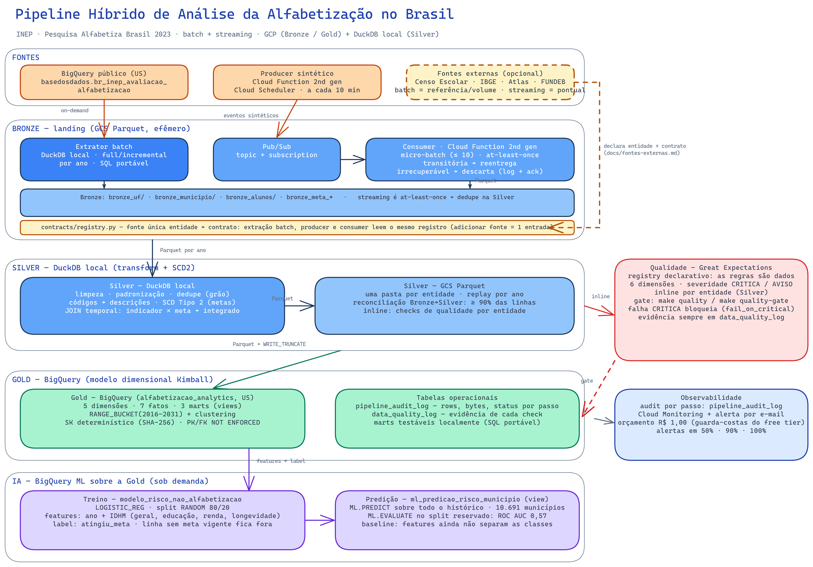

# Pipeline Híbrido de Análise da Alfabetização no Brasil

Tech Challenge Fase 2 (Pós FIAP) — pipeline de dados híbrido (batch + streaming) sobre GCP para o **Indicador Criança Alfabetizada** (INEP, Pesquisa Alfabetiza Brasil 2023), com a fonte pública `basedosdados.br_inep_avaliacao_alfabetizacao` (BigQuery público).

Medalhão (Bronze → Silver → Gold): Bronze, streaming e Gold no GCP; a Silver é processada por DuckDB embarcado e persistida em Parquet no GCS.

## Sumário

- [Contexto de negócio](#contexto-de-negócio)
- [Arquitetura](#arquitetura)
- [Aplicação em IA](#aplicação-em-ia)
- [Trade-offs arquiteturais](#trade-offs-arquiteturais)
- [FinOps](#finops)
- [Estrutura do repositório](#estrutura-do-repositório)
- [1. Configurar credenciais](#1-configurar-credenciais)
- [4. Rodar e testar](#4-rodar-e-testar)
- [Qualidade e testes](#qualidade-e-testes)
- [Evidências de execução](#evidências-de-execução)

## Como rodar (resumo)

Pré-requisitos: `gcloud` autenticado, Terraform (provider `google ~> 5.0`) e Python ≥ 3.11.

```bash
make install
cp .env.example .env   # preencha TF_VAR_project_id, TF_VAR_billing_account, TF_VAR_alert_email, TF_VAR_team_members (passo 1)
source .env
bash infra/bootstrap.sh $TF_VAR_project_id $TF_VAR_gcs_location   # uma vez por projeto GCP
make infra-init PROJECT_ID=$TF_VAR_project_id                     # uma vez por projeto
make pipeline-from-scratch   # infra efêmera + batch + streaming + reprocessamento + quality-gate
make infra-destroy           # sempre que terminar de testar
```

Detalhes, o aviso do acesso do time e os passos completos (1 a 5) estão logo abaixo.

## Contexto de negócio

O Compromisso Nacional Criança Alfabetizada é uma política pública (União + estados + DF + municípios) que busca garantir que toda criança brasileira esteja alfabetizada até o fim do 2º ano do ensino fundamental, com meta de 100% até 2030. O Indicador Criança Alfabetizada mede o percentual de estudantes que atingem o corte de 743 pontos na escala Saeb. Entender os fatores que influenciam esse resultado exige cruzar metas nacionais/estaduais/municipais, dados territoriais e desempenho — dados que a Base dos Dados expõe nativamente via BigQuery.

Este projeto simula o trabalho de um time de engenharia de dados de uma organização pública de análise educacional, entregando uma camada analítica confiável para subsidiar políticas públicas baseadas em evidência.

## Arquitetura

Arquitetura Lambda (camada batch + camada streaming convergindo na mesma camada Bronze), seguindo o padrão Medalhão (Bronze → Silver → Gold): GCP para Bronze, streaming e Gold; a Silver é processada com DuckDB embarcado no mesmo processo Python e persistida em Parquet no GCS (justificativa na seção de trade-offs).



- **Fonte**: BigQuery público (`basedosdados.br_inep_avaliacao_alfabetizacao`), sem exportação intermediária. Fontes externas de enriquecimento (Censo Escolar, IBGE, Atlas, FUNDEB) entram por declaração, não por código novo: o caminho (batch para volume/referência, streaming para atualização pontual) e o checklist de integração estão em [docs/fontes-externas.md](docs/fontes-externas.md).
- **Batch**: `extraction.extract_full`/`extract_incremental` lêem do BigQuery público e gravam Parquet particionado por entidade/ano na Bronze (GCS). Full na primeira execução, incremental nas seguintes; lotes acima de `BATCH_THRESHOLD` são escritos em múltiplos arquivos por partição (`part-{n}.parquet`), sem apagar lotes anteriores. Toda query do pipeline carrega um teto de custo (`maximum_bytes_billed` de 10 GB): scan acidental caro falha em vez de cobrar.
- **Streaming**: `producer` gera eventos sintéticos (indicador/medição/meta) e publica no tópico Pub/Sub `alfabetizacao-streaming-events`, disparado por Cloud Scheduler via Cloud Function (Gen2). `consumer` faz pull da subscription, decodifica pelo contrato Pydantic correspondente e grava micro-batches na mesma Bronze, particionados por data de ingestão (`data_ingestao=YYYY-MM-DD`). A escrita é append-only: cada execução do consumer grava um arquivo próprio (`part-{run_id}.parquet`) e nunca limpa a partição do dia, então micro-batches sucessivos se somam em vez de se substituírem. O `publish_time` da mensagem vira a coluna `data_evento` na linha — o event time que permite medir o lag ponta a ponta (ingestão − evento), não apenas o lag da fila. Falha é classificada pela natureza: transitória (falha na escrita da Bronze) não é confirmada e a reentrega do Pub/Sub é o mecanismo de recuperação; irrecuperável (entidade fora do registro ou payload fora do contrato) é logada com `message_id`, entidade e payload truncado, confirmada e descartada — reentregar produziria o mesmo erro para sempre e o lote acumulado paralisaria o consumo das mensagens válidas.
- **Contratos**: modelos Pydantic (`contracts/models.py`) validam e serializam para Arrow/Parquet, garantindo que Bronze batch e Bronze streaming escrevam sob o mesmo schema por entidade. A associação entidade → contrato vive num único registro (`contracts/registry.py:ENTITY_MODELS`), lido pelos três pontos de ingestão (extração batch, producer e consumer): antes essa declaração existia em três mapas independentes e registrar a entidade num só deles falhava silenciosamente — hoje adicionar uma fonte nova é acrescentar uma entrada, e erro de digitação no nome da entidade vira mensagem que diz exatamente onde declarar.
- **Observabilidade**: cada execução (batch ou streaming) registra uma linha na tabela de auditoria BigQuery (`alfabetizacao_analytics.pipeline_audit_log`) com `run_id`, linhas lidas/escritas, duração e status; logs estruturados em JSON; Consumer Lag do Pub/Sub monitorado via `num_undelivered_messages`; alerta por e-mail em erro. O `run_id` da auditoria é o mesmo que nomeia o arquivo Parquet do micro-batch de streaming, ligando cada arquivo da Bronze à sua linha de auditoria.
- **Silver** (DuckDB local): `silver.pipeline.run_silver` lê a Bronze inteira de uma entidade, traduz códigos (`rede`/`serie`) e enriquece com os diretórios de UF/município e com o Atlas do Desenvolvimento Humano — IPEA/PNUD/FJP, `mundo_onu_adh.municipio` (IDHM geral + educação/renda/longevidade) fundido no mesmo dicionário de município, não uma tabela de lookup separada (extraídos sob demanda do BigQuery público — são metadado de enriquecimento, não dado bruto do domínio, então não passam pela Bronze nem pelo streaming), normaliza `id_municipio` para 7 dígitos IBGE, deduplica por chave de negócio (resolve a reentrega at-least-once do streaming) e aplica SCD Tipo 2 nas três entidades de meta (nova versão só quando as colunas rastreadas mudam — incluindo o resultado observado). Também materializa a primeira tabela que cruza duas entidades de source: `alfabetizacao_municipio_integrado` (indicador municipal × meta municipal do mesmo ano). Ao fim de cada entidade, os checks de qualidade rodam inline sobre o frame em memória, e o run fecha com reconciliação Bronze→Silver (≥ 90% das linhas). Grava de volta no GCS: `ano=` para as entidades regulares (uf/município/alunos), tabela cumulativa sem partição para as de meta.
- **Gold**: `gold.pipeline.run_gold` lê a Silver e materializa um modelo dimensional (Kimball) no BigQuery (`alfabetizacao_analytics`): 5 dimensões (`dim_uf`, `dim_municipio`, `dim_rede`, `dim_serie`, `dim_tempo`), 7 fatos (`fact_indicador_uf`, `fact_indicador_municipio`, `fact_alunos`, `fact_alfabetizacao_municipio` — meta e resultado na mesma linha — e `fact_meta_resultado_{brasil,uf,municipio}`) e 3 marts (views prontas para consumo: `mart_evolucao_indicador_uf`, `mart_aderencia_metas_uf`, `mart_ranking_indicador_municipio`). Chaves substitutas determinísticas (SHA-256 da chave natural, 8 bytes com sinal → INT64) e PK/FK declaradas `NOT ENFORCED` — a integridade é garantida pela construção e verificada pela qualidade, não pelo banco. Cada tabela é recriada do zero a cada execução (`WRITE_TRUNCATE`) — sem merge incremental, sem estado próprio. Modelo completo em [docs/modelo-dimensional.md](docs/modelo-dimensional.md).
- **Qualidade**: checks declarativos em `src/quality/rules.py` executados por Great Expectations, mapeados às seis dimensões clássicas (unicidade, completude, validade, consistência, precisão, atualidade), com severidade `CRITICA`/`AVISO`; a evidência de cada check é persistida em `alfabetizacao_analytics.data_quality_log`. Detalhes em [docs/qualidade-dados.md](docs/qualidade-dados.md).
- **FinOps**: orçamento de R$ 1,00 + alertas como salvaguarda, free tiers dimensionando o design, cost labels por componente e ciclo de vida do dado bruto no bucket. Estimativa completa em [docs/estimativa-de-custos.md](docs/estimativa-de-custos.md).

## Aplicação em IA

A camada Gold (modelo dimensional no BigQuery, `alfabetizacao_analytics`) é o ponto de partida para modelos preditivos e analíticos sobre o indicador de alfabetização:

- **Predição de risco de não-alfabetização**: modelo supervisionado sobre `fact_indicador_municipio` + `fact_meta_resultado_municipio` (features territoriais via `dim_municipio` — incluindo IDHM geral e as componentes de educação/renda/longevidade do Atlas do Desenvolvimento Humano, não só nome/UF/região — + metas históricas + série temporal por município) para sinalizar municípios/escolas com maior probabilidade de ficar abaixo da meta, permitindo intervenção antes do resultado da avaliação. É o IDHM que dá substância socioeconômica real a essa promessa: sem ele, a única feature territorial disponível era categórica (região, capital), insuficiente para capturar o gradiente de desenvolvimento humano que a literatura de educação associa a desempenho.
- **Desigualdade educacional**: clusterização de municípios por perfil socioeducacional (combinando `fact_indicador_municipio` com os atributos territoriais e de desenvolvimento humano de `dim_municipio` — região, capital, IDHM e suas 3 componentes) para identificar grupos comparáveis e medir o efeito real de políticas públicas, isolando o contexto socioeconômico.
- **Apoio à decisão de política pública**: séries temporais em `fact_meta_resultado_{uf,municipio}` (`gap_pontos`, `atingiu_meta` por ano) para simular cenários ("o que aconteceria com a meta nacional se a UF X replicasse a trajetória da UF Y") e priorizar investimento onde o retorno marginal em alfabetização é maior.
- **Feature store para ML no grão do aluno**: `fact_alunos` já entrega a granularidade mais fina (proficiência individual, presença, preenchimento) para features de modelos supervisionados sem precisar voltar à Silver/Bronze.
- **Busca por similaridade**: um banco vetorial sobre embeddings de perfil municipal (ver trade-off de NoSQL abaixo) permitiria consultas como "encontrar municípios com contexto parecido ao do município X" — útil para transferência de boas práticas entre gestões locais comparáveis.

Os modelos em si não estão implementados neste MVP — a Gold dimensional (dimensões + fatos) já organiza os dados no formato que esse tipo de modelo consome; o próximo passo é treinar contra `alfabetizacao_analytics` diretamente do BigQuery (BigQuery ML ou export para notebook).

## Stack e por que essas escolhas

| Camada | Tecnologia | Justificativa |
|---|---|---|
| Extração/Streaming | Python + `google-cloud-bigquery`/`google-cloud-pubsub` | Sem Spark/Airflow self-hosted — volume da fonte (~4M linhas na maior entidade) não justifica cluster distribuído (ver "Spark fora do desenho" nos trade-offs abaixo); Python single-node cobre o caso |
| Formato de dados | Parquet particionado (hive-style) | Colunar, compressão eficiente, leitura seletiva por partição — custo de storage e de query menor |
| Streaming transporte | Pub/Sub (não Kafka) | Ver seção de trade-offs abaixo |
| Contratos de dados | Pydantic | Único schema por entidade compartilhado entre extração batch, producer e consumer streaming — evita drift de schema entre os dois caminhos que convergem na Bronze |
| IaC | Terraform | Infra 100% efêmera e reproduzível — sobe para demo, `terraform destroy` depois |
| Compute do Producer | Cloud Function Gen2 + Cloud Scheduler | Serverless, free tier, sem servidor para manter no ar entre execuções |
| Observabilidade | Cloud Logging + tabela de auditoria BigQuery + Monitoring | Suficiente para o escopo (sem dashboard dedicado); tudo dentro do free tier |

## Trade-offs arquiteturais

**Cloud única (GCP), não multi-cloud.** A fonte de dados (Base dos Dados/INEP) mora nativamente no BigQuery — não existe equivalente na AWS/Azure. Mesmo com uma camada de abstração multi-cloud, a extração continuaria presa ao GCP; portabilizar o resto seria engenharia sem retorno. Tirar os dados do BigQuery público para processar em outra nuvem geraria custo real de egress, o que colide direto com o orçamento free-tier do projeto. Terraform também não abstrai providers de forma nativa — "agnóstico" significaria manter 2-3 implementações paralelas por módulo, triplicando a superfície de bugs para um requisito que o desafio não pede (pede escolha justificada, não portabilidade).

**Pub/Sub em vez de Kafka.** O padrão publish/subscribe (tópico → subscription/consumer group, semântica at-least-once, monitoramento de lag) é o mesmo, mas Kafka self-hosted (ou mesmo um serviço gerenciado como Confluent Cloud/MSK) não tem free tier real, e o projeto já está comprometido com um único provedor gerenciado (GCP). Pub/Sub cobre publish/subscribe, consumer lag e entrega at-least-once dentro do orçamento zero.

**Spark fora do desenho (processamento single-node de propósito).** O volume da fonte não paga um engine distribuído: a maior entidade tem ~4M de linhas e as demais ficam na casa das dezenas de milhares — carga que uma única máquina processa em segundos. Nessa escala o gargalo é I/O de rede com a fonte, não CPU paralela, e Spark não remove I/O. O processamento pesado já está delegado aos engines certos para o tamanho do problema: o scan e as agregações sobre a fonte rodam dentro do próprio BigQuery (que é um engine distribuído — só que gerenciado e dentro do free tier), e as transformações set-based da Silver/Gold rodam em DuckDB no mesmo processo Python, sem cluster para provisionar. O que se evita é concreto: mesmo o Dataproc Serverless — que tem free tier (500 DCU-hora e 2000 GB-hora de shuffle por mês) e em modo batch é efêmero (o cluster sobe, processa e morre, sem faturar 24/7) — cobraria por job algo que o pipeline já resolve de graça, e tunar executores, partições e shuffle é complexidade operacional sem retorno nesse volume. Se o volume crescer ordens de grandeza (ex.: censo escolar nacional no grão do aluno, centenas de milhões de linhas), o caminho natural é Dataproc Serverless ou empurrar as transformações para dentro do BigQuery — a decisão é revisitável, não um veto à ferramenta.

**Sem camada de staging antes da Bronze.** Como a fonte já é uma tabela estruturada e confiável do BigQuery público (não um arquivo solto ou API instável), a extração aplica o contrato Pydantic direto na leitura e grava já na Bronze — uma camada de staging intermediária existiria só para reformatar algo que já chega formatado.

**Parquet puro (sem open table format — Delta/Iceberg/Hudi).** Sem ACID multi-writer nem time travel; no lugar disso, cada caminho de escrita tem uma regra explícita de posse da partição:

- **Batch** é dono da partição `ano=`: `clear_partition` limpa o prefixo **uma única vez por `(entidade, ano)` no início do run**, nunca dentro do loop de lotes, e cada lote grava seu próprio `part-{i}.parquet`. Reextrair um ano substitui aquele ano inteiro, de forma determinística.
- **Streaming** não é dono da partição `data_ingestao=`: ela é compartilhada por todos os micro-batches do dia, então o consumer **nunca** limpa nada e nomeia o arquivo pelo `run_id` da execução (`part-{run_id}.parquet`), o que torna a colisão com um run anterior impossível.

Isso preserva o histórico da Bronze sem depender de transações, ao custo de não ter merge/upsert.

**Cadência do recompute: o streaming é near-real-time na ingestão, não no serving.** O Consumer leva o evento ao Bronze em segundos, mas as camadas derivadas recomputam **por ciclo**, não por mensagem — e isso é consequência direta da decisão acima. Sem merge/upsert, `run_silver` lê toda a Bronze da entidade e reescreve as partições `ano=` (o SCD Tipo 2 é replayado do zero, o que é o que o torna idempotente), e a Gold rematerializa as tabelas com `WRITE_TRUNCATE`. Medido na rodada de 2026-08-17: **Silver ~4m23s** (3,9M linhas) **+ Gold ~2m56s** por passada. Disparar isso a cada micro-batch consumido significaria recomputar o histórico inteiro para processar algumas dezenas de eventos — por isso `pipeline-from-scratch` reprocessa uma vez ao fim do ciclo, e nada no projeto encadeia Consumer → Silver → Gold como gatilho automático. É a camada batch da arquitetura Lambda fazendo o seu papel: a latência analítica é a cadência do recompute, não a do evento. Baixá-la sem recomputar tudo exige merge incremental por chave de negócio, que é precisamente onde um open table format (Iceberg/Delta) deixa de ser luxo e passa a ser o componente que falta — registrado como evolução, não como lacuna acidental.

**NoSQL fora do MVP.** Pelo CAP Theorem e pela decisão de persistência poliglota, o projeto não introduz um banco NoSQL de serving no MVP — o BigQuery (Gold) já cobre consulta analítica dimensional. Um caso de uso de IA aplicada (ex.: buscar municípios com perfil educacional similar via embeddings, servidos por um banco vetorial) fica registrado como extensão natural pós-MVP, não como lacuna do design atual.

**Gold materializada via load job direto no BigQuery, não dbt.** O comentário original do Terraform previa dbt para a Gold (`main.tf` do módulo BigQuery), mas o projeto não tem — nem precisa de — um projeto dbt para 17 tabelas: introduzir `profiles.yml`, modelos SQL e o runner do dbt só para recriar o que o Python já faz (DuckDB para o SQL set-based, PyArrow para o schema) duplicaria ferramenta para o mesmo resultado. Cada dimensão/fato é uma função pura testável em `gold.transform` (mesmo padrão de `silver.transform`); a escrita usa `load_table_from_file` com `WRITE_TRUNCATE` e schema inferido do próprio Parquet — sem exigir DDL prévio no Terraform, sem staging, sem camada extra de orquestração SQL.

**Comparação meta x resultado usa o próprio ano da versão SCD2, não um join com os fatos de indicador.** As tabelas de meta já carregam, na mesma linha, o resultado observado (`taxa_alfabetizacao`) e a trajetória de metas futuras (`meta_alfabetizacao_2024..2030`) — comparar contra o alvo do próprio ano da linha evita um join client-side com granularidade diferente (indicador é por `serie`, meta não). Para que essa comparação tenha uma linha por ano, o SCD2 rastreia o **resultado observado** junto com a trajetória de metas e a participação: dois anos consecutivos só colapsam numa versão única se as três coisas forem idênticas. Rastrear apenas a trajetória faria o ano cujo alvo repetisse o anterior herdar a linha antiga inteira, levando consigo a taxa de alfabetização defasada — ou seja, o fato perderia justamente o número que existe para comparar.

## FinOps

- **Orçamento**: `google_billing_budget` monitorando a conta de faturamento, alerta em 50%/90%/100% de R$ 1,00 — o GCP não aceita um valor de budget zero, então R$ 1,00 é o menor teto configurável para sinalizar qualquer gasto que fuja do free tier, não um limite de consumo esperado.
- **Free tier estrito**: nenhum serviço sem free tier generoso entra no design (sem Dataflow, Composer ou Dataproc); GCS, BigQuery (1TB de query/mês), Pub/Sub (10GB/mês) e Cloud Functions (2M invocações/mês) cobrem o volume do projeto.
- **Infraestrutura efêmera**: todo o Terraform é desenhado para subir e cair sem sujeira — bucket com `force_destroy`, dataset com `delete_contents_on_destroy = true`, tabela de auditoria sem `deletion_protection`. Suba só para testar/demonstrar, rode `make infra-destroy` depois. A única exceção é o bucket de state (`<project>-tfstate`), criado fora do Terraform pelo `bootstrap.sh` justamente por ser pré-requisito dele — some com ele à mão quando encerrar o projeto de vez.
- **Acesso humano fora do ciclo efêmero**: `google_project_iam_member`/`google_billing_account_iam_member` do time (`roles/viewer`/`roles/editor`) moram num state Terraform separado (`infra/team-access`), não no state principal (`infra/`). Só o segundo é ephemeral — `make infra-destroy` roda `terraform destroy` sem `-target`, então qualquer IAM binding que esteja no mesmo state seria destruído junto; separar o state é a única forma de garantir que derrubar a infra de demo nunca revoga o acesso do grupo ao projeto.
- **Egress**: co-localizar o processamento na mesma nuvem da fonte (BigQuery público) evita custo de transferência entre nuvens — ver trade-off de cloud única acima.
- **Ciclo de vida do dado bruto**: o bucket do data lake degrada o storage conforme o dado envelhece (30+ dias → Nearline, 180+ dias → Coldline) e aborta multipart uploads interrompidos após 1 dia. O acesso ao dado bruto antigo é raro — a Bronze é a camada de replay (a Silver é recomputada a partir dela, e a própria Bronze pode ser reextraída da fonte pública) — então o histórico bruto não vira custo morto em Standard.
- **Estimativa de custos**: a planilha completa (recurso × consumo × free tier × preço, com o pior caso) está em [docs/estimativa-de-custos.md](docs/estimativa-de-custos.md).
- **Gold recomputada, não incremental**: no volume atual, reler a Silver e reescrever a Gold completa (`WRITE_TRUNCATE`) custa menos em bytes e em complexidade que merge incremental — detalhe e cenário de crescimento em [docs/estimativa-de-custos.md](docs/estimativa-de-custos.md).
- **Least privilege como controle de custo indireto**: a service account central (`alfabetizacao-pipeline-sa`) recebe papéis com escopo de recurso sempre que o GCP oferece um (Storage Object Admin no bucket específico, BigQuery Data Editor no dataset específico, Pub/Sub Publisher/Subscriber no tópico/subscription específicos). Dois papéis não têm equivalente com escopo de recurso no IAM do GCP e ficam necessariamente no nível do projeto: `roles/bigquery.jobUser` (rodar query/insert é uma operação de projeto, não de dataset) e `roles/monitoring.viewer` (ler a métrica de Consumer Lag). Nada além disso — reduz a superfície de uso indevido de cota.

## Estrutura do repositório

```
src/
├── config.py          # Configuração centralizada (pydantic-settings, fail-closed; .env + alias TF_VAR)
├── contracts/         # Modelos Pydantic (schema por entidade) + mapeamento Arrow + serialização Parquet
├── extraction/        # Extração full/incremental do BigQuery público -> Bronze
├── bronze/            # Leitura/escrita de partições Parquet no GCS
├── streaming/         # Producer (eventos sintéticos -> Pub/Sub) e Consumer (Pub/Sub -> Bronze)
├── silver/            # Limpeza, tradução de código, normalização de chave, dedup, SCD Tipo 2, reconciliação
├── gold/              # Modelo dimensional (Kimball) materializado no BigQuery
├── quality/           # Data Quality: registry declarativo, checks Great Expectations, gate e evidência
├── common/            # Retry compartilhado (backoff exponencial) e lock exclusivo baseado em GCS
└── observability/     # Logging estruturado, auditoria BigQuery e monitoramento (Consumer Lag)
infra/                 # Terraform: infra GCP efêmera — módulos: storage, bigquery, pubsub, streaming_function, iam, budget, monitoring, apis
infra/team-access/     # Terraform: acesso IAM humano ao console — state separado, fora do ciclo efêmero (make infra-destroy não toca aqui)
tests/                 # Testes espelhando src/, incluindo Property-Based Testing (Hypothesis)
docs/                  # Diagrama de arquitetura (Excalidraw + PNG) e documentos: modelo dimensional, qualidade de dados, estimativa de custos, integração de fontes externas
```

## Pré-requisitos

- [`gcloud` CLI](https://cloud.google.com/sdk/docs/install) autenticado, com acesso IAM ao projeto GCP alvo
- [Terraform](https://developer.hashicorp.com/terraform/install) (provider `google ~> 5.0`)
- Python >= 3.11

## 1. Configurar credenciais

```bash
gcloud auth login
gcloud auth application-default login

cp .env.example .env   # preencher com os valores do projeto (nunca commitar o .env real)
```

Edite o `.env` e preencha `TF_VAR_project_id`, `TF_VAR_billing_account`, `TF_VAR_alert_email` e `TF_VAR_team_members` com os valores do projeto.

> ⚠️ **Importante:** dentro de `infra/team-access`, `team_members` é
> gerenciado como um mapa único pelo Terraform. Se o seu `.env` tiver só o
> seu e-mail nesse mapa e você rodar `infra-team-apply`/`infra-team-destroy`,
> o Terraform **revoga o acesso de todo mundo que não estiver no seu mapa**.
> Use sempre a cópia mais recente combinada com o grupo, não invente a sua.
> Isso **não afeta** `infra-apply`/`infra-destroy` (state principal) — os
> dois states são isolados de propósito, ver passo 2 abaixo.

```bash
source .env
```

## 2. Acesso do time ao console (opcional, uma vez por projeto)

Acesso humano ao console (`roles/viewer`/`roles/editor`) vive num state
Terraform separado, `infra/team-access`, isolado do state principal
(`infra/`) de propósito: assim, destruir a infra efêmera de demo
(`make infra-destroy`) nunca revoga o acesso de ninguém ao projeto — os dois
states não compartilham recurso nenhum. Rode uma vez por projeto (ou sempre
que `TF_VAR_team_members` mudar):

```bash
make infra-team-init PROJECT_ID=$TF_VAR_project_id   # só na primeira vez
make infra-team-plan
make infra-team-apply
```

Para revogar o acesso de alguém que saiu do time de vez (raro e manual —
nunca disparado automaticamente): `make infra-team-destroy`.

## 3. Subir a infraestrutura

O Terraform guarda o state num bucket GCS (state locking, porque mais de uma pessoa aplica no mesmo projeto). Esse bucket é pré-requisito do próprio `terraform init`, então não dá para o Terraform criá-lo — `bootstrap.sh` resolve o ovo-e-galinha criando o bucket e habilitando as duas APIs (Resource Manager e IAM) sem as quais o `refresh` trava antes de conseguir habilitar as demais.

```bash
bash infra/bootstrap.sh $TF_VAR_project_id $TF_VAR_gcs_location   # só uma vez por projeto GCP

make infra-init PROJECT_ID=$TF_VAR_project_id   # só na primeira vez (ou se infra/.terraform sumir)
make infra-plan                                 # empacota o Producer e mostra o que será criado
make infra-apply                                # cria dataset BigQuery, bucket GCS, Pub/Sub, SA, budget, monitoring, Cloud Function + Scheduler
```

`infra-apply` só roda a partir da branch `main`, com a working tree limpa e sincronizada com `origin/main` (`infra/apply-guard.sh` bloqueia isso de propósito, para evitar duas pessoas aplicando mudanças conflitantes em paralelo no mesmo projeto GCP compartilhado).

## 4. Rodar e testar

```bash
make install                                     # cria venv e instala o pacote em modo dev
make test                                        # roda toda a suíte por camada

make bronze                                      # extrai as 6 entidades do BigQuery público -> Bronze (batch)
make streaming-producer TIPO=indicador N=5       # publica 5 eventos sintéticos no Pub/Sub
make streaming-consumer                          # consome o lote disponível e grava na Bronze (com event time)
make silver                                      # limpa, integra e deduplica a Bronze -> Silver (GCS), com checks inline + reconciliação
make gold                                        # materializa dimensões, fatos e marts da Silver -> Gold (BigQuery)
make quality                                     # checks de qualidade (Silver + Gold): registra a evidência e segue
make quality-gate                                # idem, mas bloqueante: sai com erro se houver falha CRITICA

make pipeline                                    # infra-apply + bronze -> silver -> gold -> quality num comando
make pipeline-from-scratch                       # derruba e recria a infra e roda o ciclo completo: batch -> streaming -> reprocessa Silver/Gold -> gate bloqueante
```

Em produção, o Producer roda sozinho via Cloud Scheduler → Cloud Function (sem intervenção manual); o Consumer, por ora, roda sob demanda (`make streaming-consumer`) — um pull single-shot não tem o mesmo encaixe natural de agendamento que o Producer tem.

**Por que só o caminho de streaming é agendado.** A extração batch (`make bronze`) roda sob demanda de propósito: a fonte é uma avaliação censitária anual do INEP e a extração incremental é particionada por ano (`extract_incremental` só busca `ano > max(ano já na Bronze)`). Agendar um job diário ou horário contra uma base que muda uma vez por ano gasta cota para não encontrar nada. O gatilho natural é a publicação de uma nova safra, que é um evento manual — quando isso deixar de valer (ou quando a Silver precisar de recomputação periódica), o caminho pronto é um Cloud Run Job com o mesmo Cloud Scheduler que já dispara o Producer.

## 5. Destruir a infraestrutura — sempre que terminar de testar

```bash
make infra-destroy
```

Todos os recursos gerenciados pelo Terraform foram desenhados para serem efêmeros de propósito — o `destroy` funciona limpo, sem sujeira. O bucket de state (`<project>-tfstate`) fica de fora, porque é ele que guarda o próprio state; remova à mão (`gcloud storage rm -r gs://$TF_VAR_project_id-tfstate`) só quando encerrar o projeto de vez. Não deixe a infra provisionada depois do seu teste; o orçamento de R$ 1,00 é só um alerta, não um limite automático que corta o projeto.

`infra-destroy` roda só no state principal (`infra/`) — o acesso humano do time (`infra/team-access`, passo 2) fica de fora de propósito: destruir a infra de demo não revoga o acesso de ninguém ao projeto.

## Qualidade e testes

Suíte por camada em `tests/` (espelhando `src/`), incluindo Property-Based Testing nas funções puras de contratos e de configuração — `make test` roda tudo.

**Qualidade de dados**: checks declarativos sobre um registry (`src/quality/rules.py`) executados por Great Expectations, mapeados às seis dimensões clássicas (unicidade, completude, validade, consistência, precisão, atualidade), com severidade `CRITICA`/`AVISO`. Três pontos de entrada: inline na Silver (por entidade, a cada run), standalone (`make quality`, com isolamento de falhas entre entidades) e bloqueante (`make quality-gate`), que só falha quando há falha `CRITICA`. A evidência de cada check — inclusive a dos que passam — é persistida em `alfabetizacao_analytics.data_quality_log`. Design completo em [docs/qualidade-dados.md](docs/qualidade-dados.md).

## Roadmap

- [x] Contratos de dados (Pydantic + Arrow/Parquet)
- [x] Infraestrutura base (Terraform: storage, BigQuery, Pub/Sub, IAM, budget, monitoring)
- [x] Observabilidade (logging, auditoria, monitoramento)
- [x] Bronze — ingestão batch (extração full/incremental do BigQuery público)
- [x] Bronze — ingestão streaming (Producer sintético + Consumer, Cloud Function + Scheduler)
- [x] Silver — limpeza, padronização, normalização de chaves, SCD Tipo 2
- [x] Gold — modelo dimensional (Kimball) materializado no BigQuery
- [x] Data Quality — testes de qualidade mapeados às seis dimensões, sobre Silver e Gold
- [ ] Enriquecimento com fontes externas (Censo Escolar/INEP, IBGE, FUNDEB) — opcional, fora do MVP
- [ ] Modelos de ML sobre a Gold (predição de risco, clusterização de desigualdade educacional)

## Evidências de execução

Cada execução deixa duas trilhas auditáveis no BigQuery: `pipeline_audit_log` (linhas lidas/escritas, bytes processados, duração e status por etapa) e `data_quality_log` (veredito de cada check, inclusive o dos que passam). Consultas de referência:

```sql
-- Resumo do último ciclo: uma linha por etapa (extração, streaming, silver, gold)
SELECT step, layer, rows_read, rows_written, duration_seconds, status, run_id
FROM `<project_id>.alfabetizacao_analytics.pipeline_audit_log`
ORDER BY timestamp DESC
LIMIT 30;

-- Falhas críticas do gate (resultado vazio = gate passou)
SELECT entidade, check, dimensao, valor_medido, limiar, detalhe
FROM `<project_id>.alfabetizacao_analytics.data_quality_log`
WHERE severidade = 'CRITICA' AND passou = FALSE
ORDER BY timestamp DESC;
```

### Saída real dessas consultas

Capturada em 2026-08-17, 21h40 (BRT). A infraestrutura segue ativa — o log é append-only e o Scheduler continua disparando o Producer a cada 10 min — então a consulta 1 exibe novas linhas no topo quando reexecutada.

**Consulta 1 — últimas 30 linhas de `pipeline_audit_log`:**

```csv
step,layer,rows_read,rows_written,duration_seconds,status,run_id
Streaming_Producer,Bronze,NULL,1,0.362,SUCCESS,3cbd1359-75a3-41bb-bb9b-c5b6969a6f2e
Streaming_Producer,Bronze,NULL,1,0.518,SUCCESS,2dc7cfbb-09a1-4c92-8336-b2c12709cea2
Streaming_Producer,Bronze,NULL,1,0.281,SUCCESS,e2e39719-3a3b-43b6-9d28-062e81e88f6d
Streaming_Producer,Bronze,NULL,1,0.326,SUCCESS,1ca6c67f-d8ad-4543-bba5-29fbd6848550
Streaming_Producer,Bronze,NULL,1,0.394,SUCCESS,70b6a45d-3fe1-42ae-b0de-bf89f64a4ae6
Streaming_Producer,Bronze,NULL,1,0.348,SUCCESS,ad9a6b9a-556a-43d6-9991-9e99a52694f1
Streaming_Producer,Bronze,NULL,1,0.385,SUCCESS,fb72efe0-54e1-4d7c-8f35-bb4f8fe887aa
Streaming_Producer,Bronze,NULL,1,0.335,SUCCESS,1c17dc0c-40f6-4248-a751-cd0e1096d5e5
Streaming_Producer,Bronze,NULL,1,0.386,SUCCESS,cabdb888-1179-47de-8a30-af07509afff0
Streaming_Producer,Bronze,NULL,1,0.283,SUCCESS,f08d99e4-14da-43ac-a87b-1a1fbad0457b
Streaming_Producer,Bronze,NULL,1,0.299,SUCCESS,147ef62c-8863-4bb2-80f4-cbc9ae117788
Streaming_Producer,Bronze,NULL,1,0.449,SUCCESS,5ff7ffef-82d0-4fb0-b259-c22710c54739
Streaming_Producer,Bronze,NULL,1,0.312,SUCCESS,7138aa59-2718-426d-9ebf-e3981d3729ea
Streaming_Producer,Bronze,NULL,1,0.321,SUCCESS,7ffc179b-8e31-4583-9039-1296a32e8d32
Streaming_Producer,Bronze,NULL,1,0.281,SUCCESS,1415d271-c8d9-4f71-a9ec-654cc0cc4295
Streaming_Producer,Bronze,NULL,1,0.301,SUCCESS,9048ce92-6f67-437b-87fb-bac8b1a6d4d8
Streaming_Producer,Bronze,NULL,1,0.353,SUCCESS,723e7785-93ee-41cf-a1e7-673986cfe991
Streaming_Producer,Bronze,NULL,1,0.347,SUCCESS,c297b9d8-0eb8-4665-8859-042f214882e8
Gold,Gold,NULL,NULL,2.458,SUCCESS,7b05ac26-fa2f-43b0-b21b-f416e7d99d11
Gold,Gold,NULL,NULL,2.602,SUCCESS,f0ce744e-3615-48d4-a41a-c16e8785b7cc
Gold,Gold,NULL,NULL,2.425,SUCCESS,b2d8b013-4f58-40c3-aa5f-04acc8283c97
Gold,Gold,10700,10700,12.166,SUCCESS,4daf0ba6-9f52-4ba1-9083-f6af94eea9a9
Gold,Gold,80,80,10.591,SUCCESS,deddbc70-d4e8-4f9e-80d5-77dd16588172
Gold,Gold,3,3,12.518,SUCCESS,bd1e5f89-e732-4059-b1ca-95d2c471bb40
Gold,Gold,3868001,3868001,36.364,SUCCESS,61f00241-e401-48ed-befa-12c8d08a4e16
Gold,Gold,23996,23996,13.565,SUCCESS,b6989ecc-7ee2-4812-9609-c1225e1e88ce
Gold,Gold,23996,23996,17.83,SUCCESS,45d6e79b-1e62-4bbc-845c-df487fbf1c00
Gold,Gold,146,146,13.126,SUCCESS,a2ba2c40-7d07-458b-b27a-1d51e81267b1
Gold,Gold,8,8,9.643,SUCCESS,fcfaf8ef-2d05-4817-b57d-0ff8e5e84212
Gold,Gold,1,1,11.398,SUCCESS,43691bdc-2b14-44a5-82ed-d0e7019c9622
```

18 eventos do Producer disparados pelo Scheduler (0,28–0,52 s cada) e 12 das 15 etapas do Gold da última rodada de batch (9,6–36,4 s), todas `SUCCESS`. As etapas de Gold sem contagem de linhas são os marts — views prontas para consumo, sem carga de dados. Nenhuma execução registrada tem status diferente de `SUCCESS`.

**Consulta 2 — falhas críticas no `data_quality_log`:**

```csv
entidade,check,dimensao,valor_medido,limiar,detalhe
```

Resultado vazio: nenhuma falha crítica registrada — o gate de qualidade passou.

**Dimensões das tabelas da Gold:**

```csv
table_id,row_count
data_quality_log,272
dim_municipio,5571
dim_rede,6
dim_serie,1
dim_tempo,8
dim_uf,27
fact_alfabetizacao_municipio,23996
fact_alunos,3868001
fact_indicador_municipio,23996
fact_indicador_uf,146
fact_meta_resultado_brasil,3
fact_meta_resultado_municipio,10700
fact_meta_resultado_uf,80
mart_aderencia_metas_uf,0
mart_evolucao_indicador_uf,0
mart_ranking_indicador_municipio,0
pipeline_audit_log,70
```

O maior fato tem 3.868.001 linhas. Os marts aparecem com `row_count` 0 no metadado porque são views — a amostra abaixo mostra o que devolvem.

**Amostra real de `mart_evolucao_indicador_uf`:**

```sql
SELECT ano, sigla_uf, taxa_media_alfabetizacao, media_portugues_media, delta_pp_vs_ano_anterior
FROM `<project_id>.alfabetizacao_analytics.mart_evolucao_indicador_uf`
ORDER BY ano DESC, sigla_uf
LIMIT 10;
```

```csv
ano,sigla_uf,taxa_media_alfabetizacao,media_portugues_media,delta_pp_vs_ano_anterior
2026,CE,26.23,1.83,-56.77666666666667
2024,AC,51.68,739.4433333333333,NULL
2024,AL,45.86666666666667,732.6133333333333,3.6466666666666683
2024,AM,51.27333333333333,735.91,-3.403333333333336
2024,AP,45.153333333333336,737.87,3.776666666666671
2024,BA,35.585,724.9525,-3.2083333333333357
2024,CE,83.00666666666667,794.4033333333333,0.44000000000001194
2024,ES,76.26666666666667,763.0933333333334,6.256666666666675
2024,GO,76.37666666666667,761.49,6.359999999999999
2024,MA,65.60666666666667,753.4766666666667,3.873333333333335
```

A camada analítica responde com o dado real do INEP (2023: 70 linhas; 2024: 75). A única linha de 2026 é o evento sintético publicado pelo Producer (caminho de streaming). `delta_pp_vs_ano_anterior` é NULL no primeiro ano de cada UF, quando não há ano anterior na fonte para o `LAG`.

Rodada completa em GCP em 2026-08-17 (`make pipeline-from-scratch`): 3.902.927 linhas extraídas com zero rejeição de contrato, 0 falhas em 76 checks (212 vereditos) e o Cloud Scheduler disparando o Producer sozinho a cada 10 min — números por etapa, custo real da rodada e cenário de crescimento em [docs/estimativa-de-custos.md](docs/estimativa-de-custos.md#medições-reais-rodada-de-2026-08-17).
