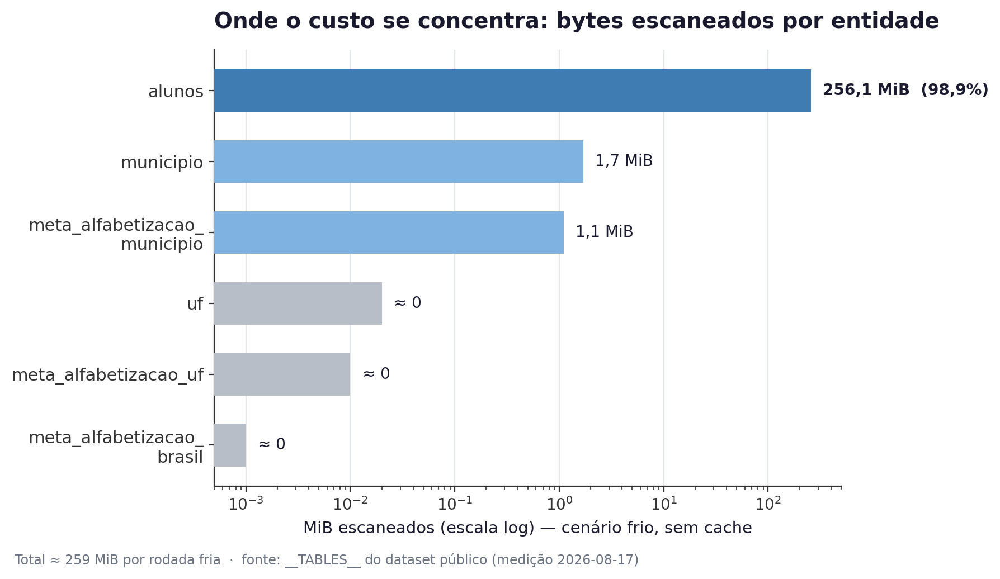
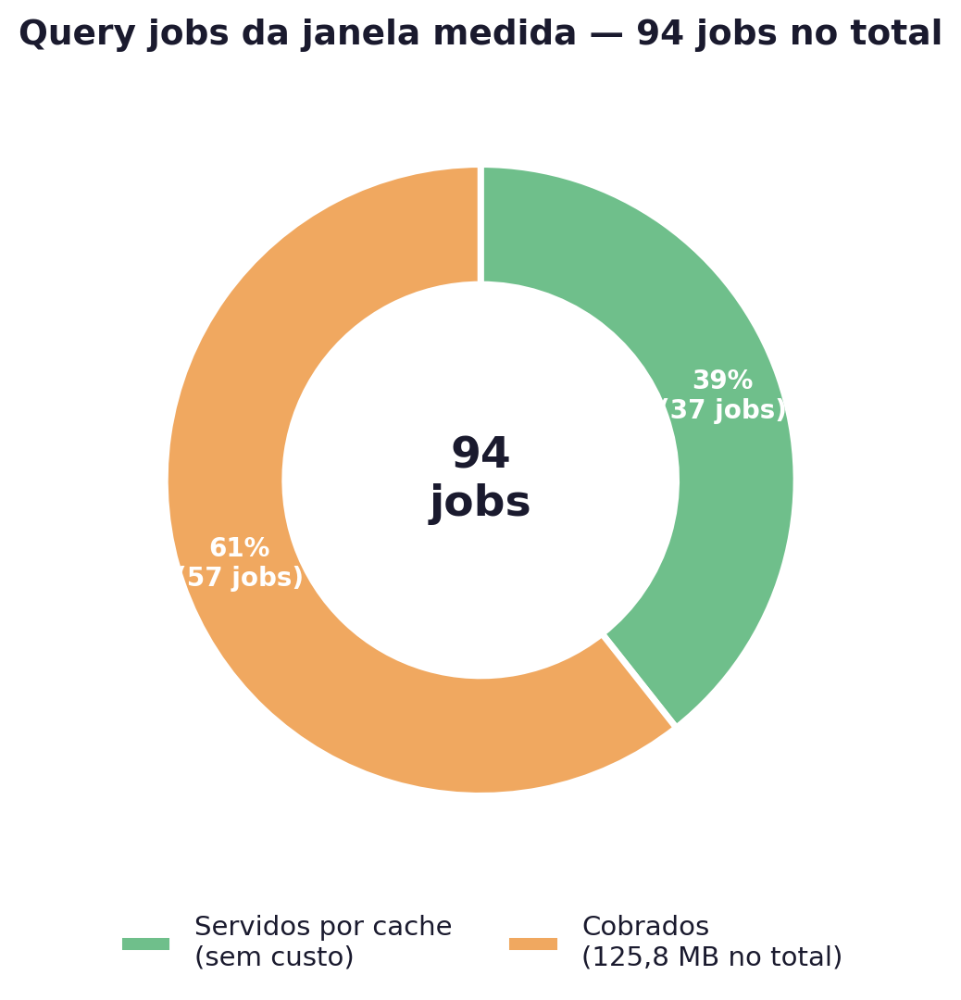
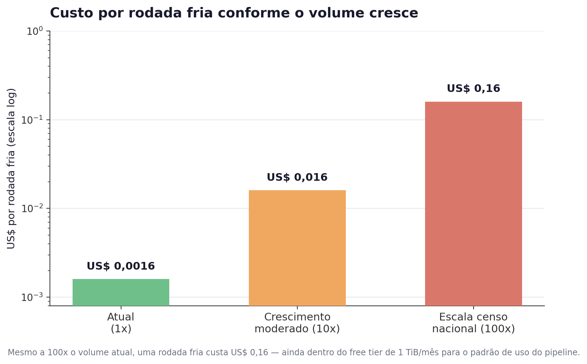

# Estimativa de custos

Preços vigentes em 2026-08, verificados na tabela de preços oficial do Google Cloud (região US) em 2026-08-17, sobre o volume que o pipeline efetivamente produz — não sobre projeções.

## Resumo executivo

| Métrica | Valor |
|---|---|
| Custo mensal esperado | **R$ 0** (100% dentro dos free tiers) |
| Custo medido por rodada completa (cache quente, dado real) | **US$ 0,0008** (94 query jobs, 37 servidos de cache, 125,8 MB cobrados) |
| Custo por rodada fria (sem cache, pior caso de scan) | **US$ 0,0016** (≈ 259 MiB escaneados) |
| Salvaguarda orçamentária | Orçamento de **R$ 1,00** com alertas em 50/90/100% — desvio aparece em dias, não em meses |
| Margem até o teto do free tier de BigQuery (1 TiB/mês) | **~4.000 rodadas frias/mês** (o pipeline roda algumas vezes/semana) |
| Resiliência a crescimento de volume | Mesmo a **100x** o volume atual (~390M linhas, escala censo nacional) o consumo de query cabe dentro do free tier mensal — ver [Cenário de crescimento](#cenário-de-crescimento-10x--100x) |
| Maior custo unitário do pipeline | Entidade `alunos`: **98,9% dos bytes escaneados** (256,1 MiB de ≈259 MiB) — é o único ponto que merece atenção se o volume crescer |

Em uma frase: o pipeline foi desenhado para não gerar fatura em condições normais de uso, e os números medidos em produção confirmam a premissa — a rodada mais cara registrada até agora custou menos de um décimo de centavo de dólar.

## Objetivo

O projeto é dimensionado para rodar dentro dos **free tiers** do GCP. Como salvaguarda contra qualquer desvio dessa premissa, a infraestrutura provisiona um **orçamento de R$ 1,00** com alertas em 50%, 90% e 100% — o primeiro custo técnico, se existir, aparece em dias, não em meses.

## Recursos provisionados (Terraform)

| Recurso | Propósito | Modelo de cobrança |
|---|---|---|
| GCS bucket `{project}-datalake` | Bronze e Silver efêmeros (Parquet) + código do producer em `_deploy/` | Storage Standard: ~US$ 0,020/GB·mês |
| BigQuery dataset `alfabetizacao_analytics` (localização `US`) | Gold (5 dims, 7 facts, 3 marts) + `pipeline_audit_log` + `data_quality_log` | Query on-demand: US$ 6,25/TiB escaneado + storage US$ 0,02/GB·mês (ativo) |
| Pub/Sub topic + subscription | Streaming sintético (producer → consumer) | US$ 40/TiB de throughput + retenção |
| Cloud Function 2nd gen `alfabetizacao-streaming-producer` (256 MB, até 1 instância) | Publica eventos sintéticos | Cloud Run: vCPU-s e GB-s |
| Cloud Scheduler | Dispara o producer a cada 10 min (`*/10 * * * *`) | US$ 0,10/job·mês (free tier: 3 jobs/mês por conta de faturamento) |
| Service account (IAM), canal de monitoramento (e-mail), alerta de orçamento | Acessos, alertas, salvaguarda | sem custo |

Todos os recursos cobráveis levam cost labels (`pipeline`, `componente`), permitindo atribuir o custo por camada no relatório de faturamento.

## Volumes: piso mínimo (quality gate) vs. volume real observado

Dois números diferentes aparecem neste documento e não devem ser confundidos:

- **Piso mínimo** (tabela abaixo): o menor volume aceitável por execução, verificado pelo gate de qualidade (`src/quality/rules.py`). Se uma extração vier abaixo disso, o check `CRITICA` de volume falha e o pipeline para — é uma salvaguarda contra ingestão incompleta, não uma previsão de volume.
- **Volume real observado**: o que a fonte pública de fato contém, medido na rodada de produção — ver [Medições reais](#medições-reais-rodada-de-2026-08-17) logo abaixo. Para `alunos`, por exemplo, o piso é 100.000 linhas mas o volume real medido foi **3.867.999** (quase 39x o piso) — a folga entre os dois números é intencional, para que o check não dispare em falsos positivos por sazonalidade normal da fonte.

| Entidade | Piso mínimo (gate de qualidade) | Volume real observado (rodada 2026-08-17) |
|---|---:|---:|
| `alunos` | 100.000 | 3.867.999 |
| `municipio` | 1.000 | 23.995 |
| `meta_alfabetizacao_municipio` | 1.000 | 10.704 |
| `uf` | 27 | 145 † |
| `meta_alfabetizacao_uf` | 27 | 81 |
| `meta_alfabetizacao_brasil` | 1 | 3 |

† `uf` tem 27 unidades federativas, mas 145 linhas porque a entidade é histórica (múltiplos anos por UF), não um snapshot único.

Em todos os anos, o volume fica na ordem de ~10⁶ linhas e algumas centenas de MB em Parquet (Bronze + Silver + Gold). Por execução full (extração do dataset público + leituras Silver/Gold/qualidade), o volume escaneado no BigQuery fica na ordem de algumas centenas de MB — o valor medido por execução está em `pipeline_audit_log` (`total_bytes_processed` por passo), com a ressalva do cache de resultados explicada na seção de medições abaixo.

## Medições reais (rodada de 2026-08-17)

Rodada completa de `make pipeline-from-scratch` (destroy de 30 recursos → apply de 36 → batch + streaming + gate), medida em `pipeline_audit_log`, `data_quality_log` e `INFORMATION_SCHEMA.JOBS`:

| Etapa | Entidade | Linhas lidas | Linhas escritas | Duração |
|---|---|---:|---:|---:|
| Bronze | uf | 145 | 145 | 7,3 s |
| Bronze | municipio | 23.995 | 23.995 | 11,7 s |
| Bronze | meta_alfabetizacao_brasil | 3 | 3 | 8,7 s |
| Bronze | meta_alfabetizacao_uf | 81 | 81 | 8,0 s |
| Bronze | meta_alfabetizacao_municipio | 10.704 | 10.704 | 10,0 s |
| Bronze | alunos | 3.867.999 | 3.867.999 | 985,3 s |
| Silver | 6 entidades | 3.902.927 | 3.902.920 | ~278 s (total) |
| Gold | 5 dims + 7 fatos + 3 marts | — | — | ~161 s (total) |
| Qualidade | 2 passes completos × 76 checks + inline Silver | — | — | 212 vereditos, 0 falhas |

- **Total extraído**: 3.902.927 linhas; `rows_read == rows_written` nas 6 extrações — zero rejeições de contrato em dados reais. Na Silver, a deduplicação por chave de negócio aparece: `meta_alfabetizacao_uf` 81 → 80 e `meta_alfabetizacao_municipio` 10.704 → 10.698.
- **Bytes processados = 0 nas extrações — não é bug, é cache.** As queries contra a fonte pública foram servidas pelo cache de resultados do BigQuery (a fonte é imutável entre rodadas e o cache vale ~24 h, independente do ciclo destroy/apply das tabelas do projeto). Medição agregada da janela via `INFORMATION_SCHEMA.JOBS`: 94 query jobs, 37 servidos de cache, 31,6 MB processados / 125,8 MB cobrados → **~US$ 0,0008** na rodada.
- **Nova consulta de referência (Atlas IDHM)**: `silver.reference.get_atlas_idhm` roda mais uma query de enriquecimento (`mundo_onu_adh.municipio`, ~5.570 linhas — mesma ordem de grandeza de `br_bd_diretorios_brasil.municipio`, já contabilizado nos 94 jobs acima) a cada execução da Silver que processa `municipio`/`meta_alfabetizacao_municipio`. Não medida isoladamente nesta rodada (tabela pequena, dentro do mesmo padrão de cache dos diretórios existentes), mas pelo mesmo raciocínio: irrelevante fria, gratuita com cache — não desloca a conclusão de que o custo do pipeline é dominado por `alunos`.
- **Cenário frio (sem cache)**: o scan completo das 6 tabelas da fonte soma **≈ 259 MiB** (`alunos` 256,1 MiB + `municipio` 1,7 + `meta_alfabetizacao_municipio` 1,1; demais ≈ 0), medido em `__TABLES__` do dataset público. A US$ 6,25/TiB, uma rodada fria custa **~US$ 0,0016**; o free tier de 1 TiB/mês comporta **~4.000 rodadas completas**.

### Onde o custo se concentra

`alunos` sozinha responde por **98,9%** dos bytes escaneados por rodada — é a única entidade que, numa hipótese de crescimento, moveria o ponteiro de custo (ver [Cenário de crescimento](#cenário-de-crescimento-10x--100x) abaixo). As outras 5 entidades são, na prática, gratuitas mesmo em cenário frio.

Mais de um terço dos jobs nem chegou a escanear dado — o cache de 24h do BigQuery absorve reexecuções dentro do mesmo dia, o que também protege contra reprocessamento acidental durante debug.

## Estimativa por serviço

| Serviço | Consumo mensal | Free tier | Custo esperado |
|---|---|---|---|
| BigQuery (queries) | Algumas centenas de MB escaneados por execução, algumas execuções/semana | 1 TiB/mês | **R$ 0** |
| BigQuery (storage) | Algumas GB (Gold + tabelas operacionais) | — | centavos de US$/mês |
| Cloud Storage | Algumas GB | 50 GB/mês (Standard, US) | **R$ 0** |
| Pub/Sub | Eventos sintéticos em KB | 10 GiB de throughput + 24h de retenção | **R$ 0** |
| Cloud Function 2nd gen | 144 invocações/dia × 256 MB × ~2s ≈ 290 vCPU-s/dia | Cloud Run (180k vCPU-s/dia, 360k GB-s/dia) | **R$ 0** |
| Cloud Scheduler | 1 job (`*/10 * * * *`) | 3 jobs/mês | **R$ 0** |
| IAM, monitoramento, orçamento | — | — | R$ 0 |

### Cloud Scheduler — cobrança por job, não por execução

O Cloud Scheduler cobra por **job agendado** (a definição), não por execução: US$ 0,10/job/mês, com free tier de 3 jobs/mês por conta de faturamento. O projeto tem exatamente **1 job** (o que dispara o producer a cada 10 min) — as ~4.300 execuções/mês que ele gera não são cobradas pelo Scheduler (o alvo, Cloud Function, tem seu próprio free tier, já contabilizado acima). Custo efetivo: **R$ 0**.

## Total mensal

- **Esperado: R$ 0** (tudo dentro dos free tiers, incluindo o Scheduler).
- **Pior caso: centavos de US$/mês** (storage BigQuery/GCS se os dados persistirem além da demonstração; o alerta de orçamento de R$ 1 é a salvaguarda contra qualquer desvio dessa estimativa).

## Cenário de crescimento (10x / 100x)

O README cita, nos trade-offs, um cenário de crescimento de ordens de grandeza — por exemplo, o Censo Escolar nacional no grão do aluno (centenas de milhões de linhas). Como o custo de query do BigQuery é linear em bytes escaneados, e `alunos` já é 98,9% do scan, a projeção de custo é direta: multiplicar o volume da entidade `alunos` e manter as demais praticamente constantes.

| Cenário | Multiplicador | Linhas `alunos` (aprox.) | Bytes escaneados (frio) | Custo por rodada fria | Rodadas frias que cabem no free tier (1 TiB/mês) |
|---|---:|---:|---:|---:|---:|
| **Atual** (medido) | 1x | 3,9M | ≈ 259 MiB | ≈ US$ 0,0016 | ≈ 4.000/mês |
| **Crescimento moderado** | 10x | ≈ 39M | ≈ 2,6 GiB | ≈ US$ 0,016 | ≈ 400/mês |
| **Escala censo nacional** | 100x | ≈ 390M | ≈ 26 GiB | ≈ US$ 0,16 | ≈ 40/mês |

**Leitura prática:**

- Mesmo a **100x**, uma rodada fria custa **US$ 0,16** — para o padrão de uso atual (algumas execuções por semana), o consumo mensal de query continua muito abaixo do 1 TiB gratuito, e o orçamento de R$ 1,00 segue como salvaguarda suficiente.
- O ponto onde o free tier de query deixaria de sobrar é em torno de **~40 rodadas frias/mês a 100x** — ou seja, o pipeline precisaria rodar mais de uma vez por dia *nesse volume* para começar a gerar custo real de query. Hoje ele roda sob demanda / algumas vezes por semana.
- O que **não** escala linearmente de graça é o *processamento* fora do BigQuery: a Silver (DuckDB embarcado, single-node) e o storage no GCS. A 100x, ~390M linhas de `alunos` já se aproximam do ponto em que o trade-off "Spark fora do desenho" do README deixa de valer — o próprio README já antecipa esse limite e aponta o caminho (Dataproc Serverless ou empurrar a transformação para dentro do BigQuery). Ou seja: **o teto de custo em query não é o gargalo nesse cenário — o teto de memória de um processo single-node é.**
- Storage no GCS (Bronze + Silver em Parquet) cresce também de forma aproximadamente linear com o volume; a 100x, os dados brutos passariam a se aproximar do teto de 50 GB do free tier de Cloud Storage, o que já justificaria revisar o ciclo de vida do bucket (hoje configurado para dados efêmeros de demo) antes de chegar lá.

## Boas práticas de FinOps aplicadas

Além da estimativa de custo em si, o pipeline aplica três práticas que reduzem custo pela forma como processa dado, não só pelo que fica dentro do free tier:

### Uso eficiente de armazenamento (Parquet + particionamento)

- **Formato**: todas as camadas (Bronze, Silver, Gold intermediária) usam **Parquet colunar** — leitura seletiva de colunas e compressão nativa, contra CSV/JSON que forçariam scan de linha inteira e storage sem compressão.
- **Particionamento hive-style**: a Bronze grava por `ano=` (entidades regulares) ou `data_ingestao=YYYY-MM-DD` (streaming) — `src/bronze/writer.py::build_partition_path`. Isso permite que a Silver leia (`src/bronze/reader.py::read_partition`) só a partição de interesse em vez do dataset inteiro quando o caller passa uma chave específica.
- **Ciclo de vida do bucket**: dado bruto com 30+ dias migra para Nearline, 180+ dias para Coldline (Terraform, ver seção FinOps do README) — o histórico completo fica preservado (requisito do enunciado) sem pagar tarifa Standard por dado raramente acessado.

### Otimização de queries

- **Teto de custo por query**: toda extração roda com `maximum_bytes_billed=10 GB` (`src/extraction/extraction.py`, `MAX_BYTES_BILLED = 10 * 2**30`) — um scan acidentalmente caro (ex: bug de filtro) falha a query em vez de gerar fatura. É uma trava técnica, não só uma boa intenção documentada.
- **Extração incremental evita reler o histórico**: depois da carga full, as execuções seguintes usam `WHERE ano > {max_existing}` (`src/extraction/extraction.py`) — cada execução escaneia só o ano novo, não a tabela inteira de novo.
- **Cache de resultados do BigQuery**: como a fonte pública não muda entre rodadas, o cache de 24h absorve reexecuções no mesmo dia — na rodada medida, 37 dos 94 query jobs (39%) foram servidos de cache sem custo algum (ver [gráfico acima](#onde-o-custo-se-concentra)).
- **Leitura seletiva de colunas na Silver**: as transformações em DuckDB (`src/silver/transform.py`) fazem `SELECT` das colunas necessárias, não `SELECT *`, reduzindo I/O de leitura do Parquet.

### Controle de recursos computacionais

- **Cloud Function dimensionada no mínimo viável**: o producer roda com **256 MB** de memória e **1 instância** máxima (`infra/modules/streaming_function/main.tf`) — não é o padrão maior do provedor, é o piso que a carga (gerar e publicar eventos sintéticos) exige.
- **Sem cluster distribuído**: a Silver processa em **DuckDB embarcado, single-node**, no mesmo processo Python — sem custo de cluster provisionado (Dataproc/Spark) para um volume que uma máquina processa em segundos (a rodada real levou ~278 s para 3,9M linhas na Silver inteira). Justificativa completa no trade-off "Spark fora do desenho" do README.
- **Um único job de scheduler**: o Cloud Scheduler dispara 1 job a cada 10 min (não N jobs), mantendo o projeto dentro do free tier de 3 jobs/mês por conta de faturamento — ver [seção dedicada](#cloud-scheduler--cobrança-por-job-não-por-execução) abaixo.
- **`WRITE_TRUNCATE` em vez de infraestrutura de merge incremental**: a Gold é recriada do zero a cada execução porque, no volume atual, isso é mais barato em bytes processados *e* em complexidade operacional do que manter lógica de merge — decisão revisitável se o volume crescer (ver [Cenário de crescimento](#cenário-de-crescimento-10x--100x)).

## Como verificar no ambiente real

- `pipeline_audit_log`: `rows_read`, `rows_written`, `total_bytes_processed` por passo e por execução.
- Relatório de faturamento filtrado pelos cost labels (por componente).
- Console GCP → Orçamentos e alertas (alertas em 50/90/100% dos R$ 1,00).